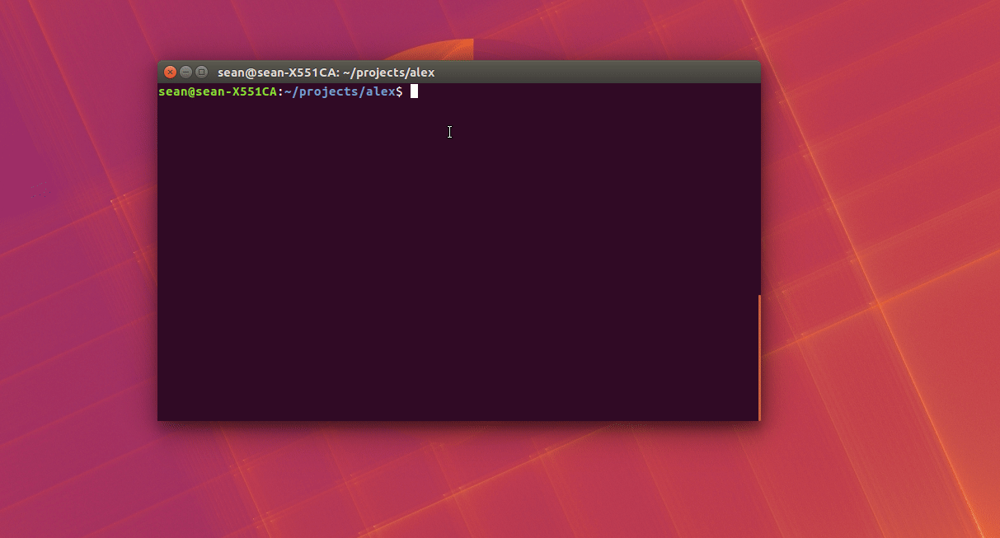

# ALEx

> (A)rcade (L)earning (E)nvironment for Eli(x)ir.

[](https://hex.pm/packages/alex)



## Overview

ALEx is an Elixir interface to the [Arcade Learning
Environment](https://github.com/Farama-Foundation/Arcade-Learning-Environment)
(ALE) — the standard platform for Atari 2600 reinforcement-learning research,
built on the [Stella](https://stella-emu.github.io/) emulator.

> The Arcade Learning Environment is a simple object-oriented framework that
> lets researchers and hobbyists develop AI agents for Atari 2600 games.

ALEx builds the ALE C++ library from source at compile time (it is **not**
vendored into this repository) and binds to it with [Fine](https://hexdocs.pm/fine).
On top of the raw bindings it provides a small, honest, gym-like API, and an
optional [Livebook](https://livebook.dev) integration for both playing games
yourself and watching an agent play.

## Installation

ALEx compiles the ALE from source, so you need a C++17 toolchain, CMake, and
zlib. SDL is optional and only needed if you want an on-screen display or sound.

### macOS

```shell
brew install cmake
# optional, for display/sound:
brew install sdl2
```

### Linux

```shell
sudo apt-get install build-essential cmake zlib1g-dev
# optional, for display/sound:
sudo apt-get install libsdl2-dev
```

### Mix

Add `alex` to your dependencies:

```elixir
def deps do
  [
    {:alex, "~> 0.4"},
    # optional, only needed for the Livebook integration:
    {:kino, "~> 0.12"}
  ]
end
```

Then run `mix deps.get` and `mix compile`. The first compile fetches and builds
the ALE, which takes a little time; subsequent builds reuse the cached library.

## ROMs

ALEx does not bundle game ROMs (other than `tetris`, used as a test fixture).
ROMs are resolved by name against a *ROM directory* — see `Alex.ROM`. You can
point ALEx at your own directory:

```elixir
config :alex, rom_dir: "/path/to/roms"
# or set the ALE_ROM_DIR environment variable, or pass rom_dir: ... per call
```

The `mix alex.roms` task installs ROMs into that directory. The easiest source is
an installed [`ale-py`](https://pypi.org/project/ale-py/) (`pip install ale-py`),
whose ROM set ALEx also auto-detects:

```shell
mix alex.roms --ale-py
# or: mix alex.roms --url https://example.com/roms.tar.gz
# or: mix alex.roms --from /path/to/roms
```

## Usage

```elixir
env = Alex.new("breakout")

env =
  Enum.reduce_while(Stream.cycle([:play]), env, fn _, env ->
    {env, info} = Alex.step(env, Enum.random(Alex.minimal_actions(env)))
    if info.game_over?, do: {:halt, env}, else: {:cont, env}
  end)

IO.puts("Episode reward: #{Alex.episode_reward(env)}")
```

Observations come back as binaries with their shape, ready for a tensor library:

```elixir
{rgb, {height, width, 3}, :u8} = Alex.Screen.rgb(env)
ram = Alex.RAM.read(env)  # 128-byte binary
```

Snapshots let you branch or rewind, and serialize for persistence:

```elixir
snap = Alex.Snapshot.save(env)
# ... play some steps ...
env  = Alex.Snapshot.restore(env, snap)

bytes = Alex.Snapshot.serialize(snap)
snap  = Alex.Snapshot.deserialize(bytes)
```

See `examples/random_agent.exs` for a complete script
(`mix run examples/random_agent.exs breakout`).

## Livebook

With `:kino` installed you can play a game yourself in the browser (ALE's
WebAssembly build, full speed, no server round-trip):

```elixir
Alex.Kino.play("breakout")
```

or watch an agent that you are driving from Elixir:

```elixir
view = Alex.Kino.view(env)

Enum.reduce(1..1000, env, fn _, env ->
  {env, _info} = Alex.step(env, Enum.random(Alex.minimal_actions(env)))
  Alex.Kino.push_frame(view, env)
  env
end)
```

### Example notebook

[`notebooks/deep_q_learning.livemd`](notebooks/deep_q_learning.livemd) trains a Deep
Q-Network (Nx + Axon + EXLA) to play an Atari game and renders training episodes live
in the notebook.

[](https://livebook.dev/run?url=https%3A%2F%2Fgithub.com%2Fseanmor5%2Falex%2Fblob%2Fmaster%2Fnotebooks%2Fdeep_q_learning.livemd)

## Documentation

* [ALEx Documentation](https://hexdocs.pm/alex)
* [Arcade Learning Environment: An Evaluation Platform for General Agents](https://arxiv.org/abs/1207.4708)

## Contributing

To contribute, please open an issue or a pull request.
