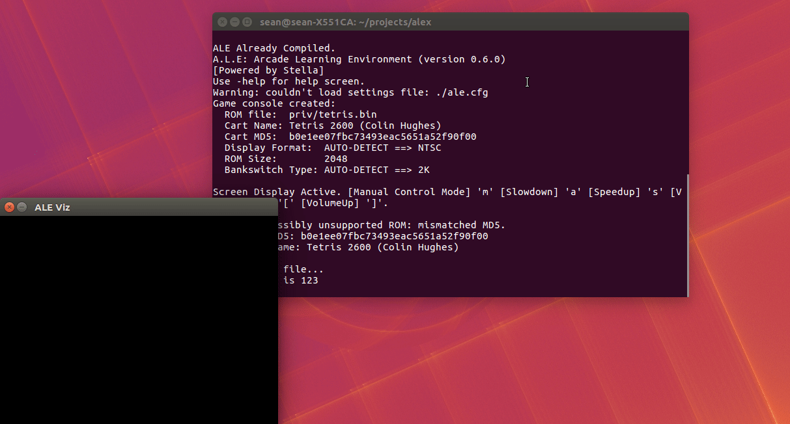

# ALEx

> (A)rcade (L)earning (E)nvironment for Eli(x)ir.

[](https://hex.pm/packages/alex)



## Documentation

* [ALEx Documentation](https://hexdocs.pm/alex/getting-started.html)
* [Arcade Learning Environment Manual](https://github.com/mgbellemare/Arcade-Learning-Environment/blob/master/doc/manual/manual.pdf)
* [Arcade Learning Environment: An Evaluation Platform for General Agents](https://arxiv.org/abs/1207.4708)

## Overview

ALEx is an implementation of the [Arcade Learning Environment](https://github.com/mgbellemare/Arcade-Learning-Environment) for Elixir.

> The Arcade Learning Environment (ALE) is a simple object-oriented framework that allows researchers and hobbyists to develop AI agents for Atari 2600 games. It is built on top of the Atari 2600 emulator [Stella](https://stella-emu.github.io/) and separates the details of emulation from agent design.

ALEx exposes the ALE Interface through NIFs. It adds an additional abstraction around the interface that makes it easy to develop on top of the ALE in Elixir.

You can interact with the ALE from the lower-level NIF interface, or you can use the higher level abstraction.

## Installation

First, install ALE dependencies:

### Linux

```shell
$ sudo apt-get install libsdl1.2-dev libsdl-gfx1.2-dev libsdl-image1.2-dev cmake
```

### Mac

```shell
$ brew install sdl
$ brew install cmake
```

### Windows

I haven't tested this with Windows yet, but I assume it should be straightforward to run. If anybody gets it working please open a pull request with your instructions.

### Mix

Then, add `alex` to your dependencies in `mix.exs`:

```elixir
def deps do
  [
    {:alex, "~> 0.3.1"}
  ]
end
```

Finally, run `mix do deps.get, deps.compile`. The first compilation will take quite a bit of time.

## Examples

ALEx comes with a Tetris agent example. To run, ensure you have the required dependencies installed and clone the repo. Then run: `mix run examples/random_agent.exs`.

The agent will make random actions over the course of a Tetris game.

## ROMs

ALEx supports all ROMs supported by ALE. ROMs are easy to find online. This Repo comes with a Tetris ROM.

See [Supported ROMs](https://hexdocs.pm/alex/supported-roms.html#content).

## Contributing

To contribute, please either create a pull request or open an issue.
